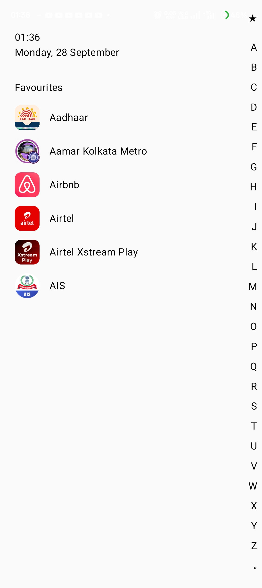
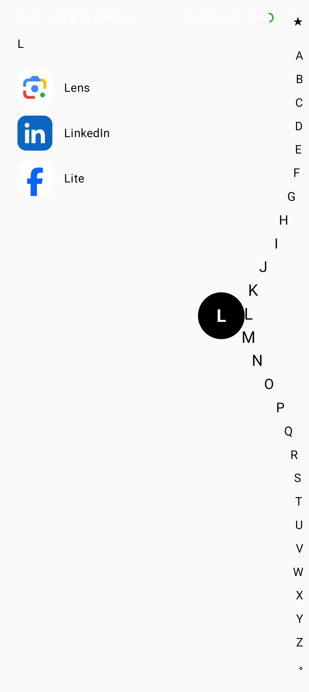

# 🚀 Alphabet Launcher

A fast, lightweight, and modern **Android Home Screen Launcher** built entirely with **Jetpack Compose** and **Material 3**. 

**Alphabet Launcher** replaces traditional multi-page app drawers with a streamlined single-screen interface and a responsive **A–Z side index rail**. Touch or drag vertically along the right edge to smoothly filter and jump directly to any installed application.

---

## 📸 Screenshots

<p align="center">
  
  &nbsp;&nbsp;&nbsp;&nbsp;
  
</p>

---

## ✨ Key Features

- **⚡ Fast A–Z Alphabet Index Rail:** Drag along the side index bar to instantly scroll through and select apps starting with any letter.
- **🌊 Dynamic Arc / Wave Animation:** Smooth mathematical curve effect where letters near your touch dynamically bulge outwards and scale up in 3D.
- **🎈 Floating Letter Indicator Bubble:** Prominent floating bubble that highlights the active letter under your finger in real time.
- **⭐ Favorites & Clock View:** Minimalist home screen featuring a live real-time digital clock, date display, and quick-access favorite apps.
- **🔍 Instant App Filtering & Launching:** Easily launch any installed application with a single tap via native `PackageManager` launch intents.
- **🔙 Gesture Navigation Support:** Integrated with Jetpack Compose `BackHandler` so pressing the system back button smoothly returns you to the main home view.
- **🎨 Pure Jetpack Compose UI:** Modern declarative UI built with Material 3 styling and smooth 60/120 FPS animations.

---

## 🛠️ Tech Stack & Architecture

- **Language:** 100% [Kotlin](https://kotlinlang.org/)
- **UI Framework:** [Jetpack Compose](https://developer.android.com/jetpack/compose) (Material 3)
- **Architecture:** MVVM (Model-View-ViewModel) + Repository Pattern
- **Async & State:** Kotlin Coroutines, `StateFlow`, `mutableStateOf`, `remember`
- **Gestures & Math:** Compose `pointerInput`, `detectDragGestures`, `graphicsLayer`, custom exponential displacement curve (`exp(-(distance^2))`)
- **Min SDK:** Android 8.0 (API Level 26)
- **Target SDK:** Android 14 / 15 (API Level 34/35)

---

## 📁 Project Structure

```text
com.example.alphabetlauncher
 ├── data
 │    ├── model          # AppInfo data model (packageName, name, icon)
 │    └── repository     # AppRepository (queries installed package intents)
 ├── ui
 │    ├── components     # Reusable UI components (AlphabetBar, LetterBubble)
 │    ├── theme          # Color, Type, and Material3 Theme definitions
 │    └── HomeScreen.kt  # Main HomeScreen layout, Clock, Favorites & Filtered views
 └── viewmodel           # LauncherViewModel (manages app state)
```

---

## 🚀 Getting Started

### Prerequisites
- **Android Studio:** Jellyfish / Ladybug / 2024.1+
- **JDK:** Java 17+
- **Device / Emulator:** Android 8.0+ (API 26+)

### Installation & Run
1. Clone the repository:
   ```bash
   git clone https://github.com/your-username/AlphabetLauncher.git
   cd AlphabetLauncher
   ```
2. Open the project in **Android Studio**.
3. Allow Gradle to sync dependencies.
4. Select an emulator or connected Android device and click **Run (Shift + F10)**.

---

## 📄 License
This project is open-source and available under the [MIT License](LICENSE).
